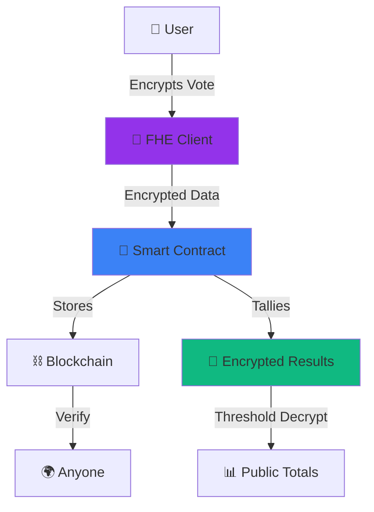

# 🗳️ Secret Voting

**Secret Voting is a blockchain-based voting system that preserves voter privacy using Zama's Fully Homomorphic Encryption (FHE) technology. Built on the FHEVM, it enables fully encrypted vote casting and counting — ensuring privacy, transparency, and trust in decentralized elections.**

<div align="center">

[](LICENSE)
[](https://www.zama.ai/)
[](https://hardhat.org/)
[](https://reactjs.org/)

 </div>

---

## 📁 Project Structure

```
Secret-Voting/
│
├── contracts/                  # Smart Contracts
│   ├── FHECounter.sol         # FHE counter implementation
│   └── SecretVote.sol         # Main voting contract
│
├── deploy/                    # Deployment Scripts
│   ├── deploy.ts              # Main deployment script
│   └── secretVote.ts          # SecretVote deployment
│
├── home/                      # Frontend Application
│   ├── public/                # Static assets
│   │   └── vite.svg
│   ├── src/                   # Source code
│   │   ├── App.tsx           # Main React component
│   │   ├── main.tsx          # Entry point
│   │   └── index.css         # Global styles
│   ├── eslint.config.js       # ESLint configuration
│   ├── index.html             # HTML template
│   ├── package-lock.json      # Frontend dependencies lock
│   ├── package.json           # Frontend dependencies
│   ├── README.md              # Frontend documentation
│   ├── tsconfig.app.json      # TypeScript config (app)
│   ├── tsconfig.json          # TypeScript config
│   ├── tsconfig.node.json     # TypeScript config (Node)
│   └── vite.config.ts         # Vite configuration
│
├── scripts/                   # Utility Scripts
│   └── deployAndTest.ts       # Deploy and test script
│
├── tasks/                     # Hardhat Tasks
│   ├── accounts.ts            # Account management
│   ├── FHECounter.ts          # FHE counter tasks
│   └── SecretVote.ts          # Voting tasks
│
├── .env.example               # Environment variables template
├── .eslintignore              # ESLint ignore patterns
├── .eslintrc.yml              # ESLint configuration
├── .gitignore                 # Git ignore patterns
├── .prettierignore            # Prettier ignore patterns
├── .prettierrc.yml            # Prettier configuration
├── .solcover.js               # Solidity coverage config
├── .solhint.json              # Solidity linter config
├── .solhintignore             # Solhint ignore patterns
├── hardhat.config.ts          # Hardhat configuration
├── LICENSE                    # BSD 3-Clause Clear License
├── package-json               # Root package.json
├── package.json               # Project dependencies
├── README.md                  # This file
├── tsconfig.json              # Root TypeScript config
└── tsconfig.node.json         # Node TypeScript config
```

---

## 💡 Why Secret Voting ?

### 🎯 The Problem We Solve

Traditional voting systems face critical challenges:
- **Privacy Concerns**: Digital voting often compromises voter anonymity
- **Trust Issues**: Centralized systems are vulnerable to manipulation
- **Transparency vs. Privacy Trade-off**: Systems either protect privacy or enable verification, rarely both
- **Coercion Resistance**: Voters can be forced to prove their choices
- **Scalability**: Physical voting doesn't scale for global decision-making

### ✨ Our Solution

Secret Voting leverages cutting-edge cryptographic technology to solve these fundamental issues:

| Traditional Voting | Secret Voting |
|-------------------|---------------|
| 📊 Vote or verify—pick one | ✅ Both: complete privacy + full transparency |
| 🔓 Centralized trust required | ⛓️ Trustless blockchain verification |
| 👀 Someone can always peek | 🔐 Mathematically impossible to see votes |
| 🗳️ Physical or compromised digital | 🌐 Accessible, secure, global |
| ⚖️ Scale vs security trade-off | 🚀 Both at once with FHE |

**Key Benefits:**
1. **True Privacy** - Individual votes remain encrypted throughout the entire process
2. **Verifiable Results** - Anyone can verify the final tallies without seeing individual votes
3. **Coercion Resistance** - Impossible to prove how you voted, even if you want to
4. **Decentralized Trust** - No single point of failure or control
5. **Global Accessibility** - Participate from anywhere with an Ethereum wallet
6. **Immutable Records** - All voting activity recorded on blockchain for transparency

---

## ⚡ Core Features

<table>
<tr>
<td width="50%">

### 🛡️ **Unbreakable Privacy**
- Votes encrypted end-to-end with FHE
- Even validators can't see your choice
- Coercion-proof: impossible to prove your vote
- MEV-resistant architecture

</td>
<td width="50%">

### 🏛️ **True Democracy**
- Anyone can create proposals
- One address, one vote
- Time-bound voting periods
- 2-16 options per proposal

</td>
</tr>
<tr>
<td width="50%">

### 🔬 **Cryptographic Integrity**
- Zero-knowledge proof verification
- Threshold cryptography for results
- Immutable blockchain records
- Open-source and auditable

</td>
<td width="50%">

### 🎨 **Seamless Experience**
- Clean, intuitive interface
- Multi-wallet support (RainbowKit)
- Real-time updates
- Mobile-first design

</td>
</tr>
</table>

---

## 🏗️ Technical Architecture

### System Overview



 ### Cryptographic Flow

```
Vote Submission Process:
1. User selects choice → Frontend encrypts with FHE public key
2. Encrypted vote → Sent to smart contract via transaction
3. On-chain processing → Vote added to encrypted tallies
4. Result finalization → Threshold decryption reveals totals
5. Public results → Individual votes remain forever encrypted
```

---

## 🛠️ Technology Stack

### Blockchain & Smart Contracts
- **Solidity ^0.8.24** - Smart contract development language
- **FHEVM Solidity Library** - Zama's FHE-enabled contract framework
- **Hardhat** - Development environment and testing framework
- **Ethers.js 6.x** - Ethereum interaction library
- **TypeChain** - Type-safe contract bindings

### Cryptographic Infrastructure
- **Zama FHEVM** - Fully Homomorphic Encryption Virtual Machine
- **TFHE** - Fast fully homomorphic encryption scheme
- **Relayer SDK** - Client-side encryption and key management
- **Threshold KMS** - Distributed key management system

### Frontend Development
- **React 19** - Modern UI framework with latest features
- **TypeScript** - Type-safe JavaScript for better development
- **Vite** - Fast build tool and development server
- **CSS3** - Custom styling without framework dependencies
- **RainbowKit** - Beautiful wallet connection interface

### Development & DevOps
- **Node.js 20+** - JavaScript runtime environment
- **NPM** - Package management
- **ESLint** - Code quality and consistency
- **Prettier** - Code formatting
- **GitHub Actions** - Continuous integration (ready for setup)

### Testing & Quality Assurance
- **Mocha** - Testing framework
- **Chai** - Assertion library
- **Hardhat Network** - Local blockchain simulation
- **Sepolia Testnet** - Ethereum test network deployment
- **Gas Reporter** - Transaction cost analysis

---

## 🚀 Quick Start

### Prerequisites

```bash
✓ Node.js >= 20.0.0
✓ NPM >= 7.0.0
✓ Git
✓ Ethereum wallet (MetaMask recommended)
✓ Sepolia testnet ETH (for testing)
```

### Installation & Setup

```bash
# Clone the repository
git clone https://github.com/your-username/SecretVote.git
cd SecretVote

# Install dependencies
npm install

# Configure environment variables
cp .env.example .env
# Edit .env and add:
# PRIVATE_KEY="0xYOUR_PRIVATE_KEY_HERE"
# INFURA_API_KEY="YOUR_INFURA_PROJECT_ID_HERE"
# ETHERSCAN_API_KEY="YOUR_ETHERSCAN_API_KEY_HERE"

# Compile smart contracts
npm run compile

# Run tests
npm run test

# Deploy to Sepolia (optional)
npm run deploy:sepolia
```

### Launch Frontend

```bash
# Navigate to frontend directory
cd home

# Install frontend dependencies
npm install

# Start development server
npm run dev

# Build for production
npm run build
```

Visit `http://localhost:5173` and start voting! 🎉

---

## 🎮 How It Works

### For Voters

1. **Connect Wallet** → Any Ethereum wallet works
2. **Browse Proposals** → See all active votes
3. **Cast Your Vote** → Client encrypts your choice with FHE
4. **Track Status** → Watch participation in real-time
5. **View Results** → See totals when voting ends (your vote stays secret!)

### For Proposal Creators

1. **Connect & Create** → Initialize a new proposal
2. **Set Parameters** → Title, options (2-16), duration
3. **Deploy** → Smart contract handles the rest
4. **Monitor** → Track votes without seeing choices
5. **Finalize** → Trigger decryption when period ends

### The Crypto Magic 🪄

```
Your Vote → [FHE Encryption] → Encrypted Blob → Smart Contract
                                                      ↓
Multiple Encrypted Votes → [Homomorphic Computation] → Encrypted Tally
                                                      ↓
Voting Ends → [Threshold Decryption] → Public Results ✓
              (Individual votes remain encrypted forever)
```

---

## 🌍 Real-World Applications

<details>
<summary><b>🏛️ Governance & DAOs</b></summary>

- Protocol upgrade decisions
- Treasury allocation votes
- Leadership elections
- Controversial proposals requiring privacy
</details>

<details>
<summary><b>🏢 Corporate Settings</b></summary>

- Board member elections
- Anonymous employee feedback
- Compensation committee decisions
- Strategic planning input
</details>

<details>
<summary><b>🎓 Academic Institutions</b></summary>

- Peer review assignments
- Student government elections
- Research funding priorities
- Department leadership selection
</details>

<details>
<summary><b>🌐 Community Governance</b></summary>

- Neighborhood development plans
- Budget allocation (participatory budgeting)
- Public service evaluations
- Local policy feedback
</details>

<details>
<summary><b>🎪 Entertainment & Social</b></summary>

- Contest judging (talent shows, hackathons)
- Community awards and recognition
- Content curation decisions
- Event planning choices
</details>

---

## 🧪 Testing & Development

### Smart Contract Testing

Our comprehensive test suite covers:
- **Unit Tests** - Individual function testing
- **Integration Tests** - Cross-contract interactions
- **FHE Tests** - Encrypted computation verification
- **Gas Analysis** - Cost optimization verification
- **Security Tests** - Attack vector validation

```bash
# Run all tests
npm run test

# Run with gas reporting
npm run coverage

# Test specific files
npx hardhat test test/SecretVote.ts

# Test on Sepolia
npm run test:sepolia
```

### Frontend Testing

```bash
cd home

# Unit tests (when implemented)
npm run test

# E2E tests (when implemented)
npm run test:e2e

# Type checking
npm run type-check
```

### Local Development Environment

```bash
# Start local Hardhat network
npx hardhat node

# In another terminal, deploy contracts
npx hardhat deploy --network localhost

# Start frontend with local contracts
cd home && npm run dev
```

---
 
## 🔒 Security

### Cryptographic Guarantees
- **IND-CPA Security** - Votes computationally indistinguishable
- **Threshold Security** - No single point of key compromise
- **Homomorphic Properties** - Computation without decryption
- **Forward Secrecy** - Past votes remain secure

### Smart Contract Security
- Comprehensive test coverage
- Access control on critical functions
- Time-lock mechanisms
- Gas-optimized to prevent DoS

### Audit Status
🔄 **Security audit in preparation** → Contact us for partnership

### Responsible Disclosure
Found a vulnerability? Please email security@yourproject.com (do not open public issues for security bugs).

---

## 🤝 Contributing

We ❤️ contributions! Whether you're a developer, designer, cryptographer, or democracy enthusiast—there's a place for you.

### Ways to Contribute

- 🐛 **Report Bugs** → [Open an issue](https://github.com/dream-colour/SecretVoting/issues)
- 💡 **Suggest Features** → Share your ideas
- 🔧 **Submit PRs** → Fix bugs or add features
- 📖 **Improve Docs** → Help others understand
- 🧪 **Write Tests** → Strengthen our security

### Development Workflow

```bash
# Fork and clone
git clone https://github.com/your-username/SecretVote.git
cd SecretVote

# Create feature branch
git checkout -b feature/awesome-feature

# Make changes and test
npm run test
npm run lint

# Commit and push
git commit -m "Add awesome feature"
git push origin feature/awesome-feature

# Open a Pull Request!
```

---

## 🌐 Supported Networks
 
### Testnet (Current)
- **Sepolia** - Primary testing and development network
- **FHEVM Testnet** - Zama's specialized test environment

### Local Development
- **Hardhat Network** - Local blockchain simulation
- **Ganache** - Alternative local blockchain
- **FHEVM Local** - Local FHE-enabled development

---

## 📚 Resources & Support

### 📖 Documentation
- [Zama FHE Documentation](https://docs.zama.ai/)
- [FHEVM Developer Guide](https://docs.zama.ai/fhevm)
- [TFHE-rs Library](https://docs.zama.ai/tfhe-rs)
- [Hardhat Documentation](https://hardhat.org/docs)

### 💬 Community
- **Twitter/X**: [@dreamcolourr05](https://x.com/dreamcolourr05)
- **Zama Discord**: [Join Community](https://discord.fhe.org)
- **Zama Telegram**: [Zama Community](https://t.me/zama_fhe)
- **GitHub Discussions**: [Ask Questions](https://github.com/zama-ai/fhevm/discussions)

### 🆘 Support
- **Project Issues**: [Report Here](https://github.com/dream-colour/SecretVoting/issues)
- **Zama Support**: [support@zama.ai](mailto:support@zama.ai)
- **Zama Docs**: [docs.zama.ai/support](https://docs.zama.ai/support)

### 🔗 Important Links
- **Zama Homepage**: [zama.ai](https://www.zama.ai/)
- **FHEVM GitHub**: [github.com/zama-ai/fhevm](https://github.com/zama-ai/fhevm)
- **Zama Blog**: [zama.ai/blog](https://www.zama.ai/blog)
- **FHE.org**: [fhe.org](https://fhe.org) - Learn about FHE technology

---

## 📜 License

This project is licensed under the **BSD 3-Clause Clear License**.

**In short**: 
- ✅ Commercial use allowed
- ✅ Modification and distribution permitted
- ✅ Private use authorized
- ❌ Patent claims not granted
- ❌ Warranty not provided

See [LICENSE](LICENSE) for full details.

---

## 🌟 Acknowledgments

Massive thanks to:
- **Zama** for pioneering FHE technology and building FHEVM
- **Ethereum Foundation** for the robust blockchain ecosystem
- **Hardhat Team** for excellent development tools
- **Open-source contributors** who make this possible
- **You** for believing in private, fair voting

---

<div align="center">

### 🗳️ Vote Your Way. Your Secret. Forever.

**Built with 💜 by [@dreamcolourr05](https://x.com/dreamcolourr05)**

**Powered by [Zama FHE](https://www.zama.ai/)**

[⭐ Star us on GitHub](https://github.com/dream-colour/SecretVoting) | [🐦 Follow on X](https://x.com/dreamcolourr05) | [📖 Read the Docs](https://docs.zama.ai/)

</div>

---

*Last Updated: October 2025 • Version 1.0.0*
*Last Updated: October 2025 • Version 1.0.0*
